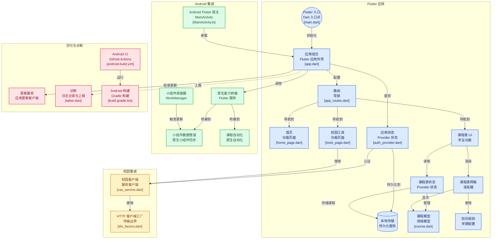

<div align="center">

# XzitPocket - 掌上徐工

[](https://opensource.org/licenses/gpl-3-0)

</div>

[掌上徐工](https://github.com/lose2me/xzitpocket) 是一款开源，高性能，跨平台，以 MD3 风格为主的校园助手APP（非官方）。  

> 当 ``WakeUp课程表`` 开始变更开发者，植入开屏广告时，我就知道我该做些什么了。

<div align="center">

***``永无广告`` ``永久开源``***

</div>

**待办 | 较大更新**: 
- [x] 桌面小组件支持
- [x] 设计软件图标
- [ ] 苹果端适配
- [x] 更多小组件类型支持
- [x] 界面优化
- [ ] 更多个性化设置
*以优先级排序*

## 软件截图
<p align="center">
  
  
  
  
</p>


## 架构




## 调试
Android
```
flutter run -d emulator-5554 --target-platform android-arm64
```

## 构建
Android
```
flutter build apk --target-platform android-arm64 --split-debug-info=./symbols --obfuscate
```

## Release
Android
```
flutter build apk --release --target-platform android-arm64
```
